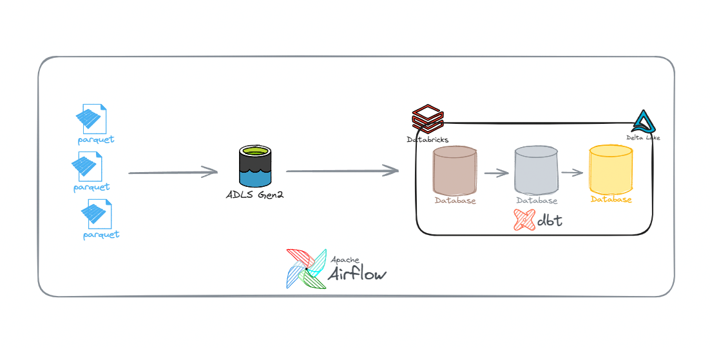

# NYC Taxi Batch Pipeline

A batch data engineering pipeline that ingests NYC Taxi & Limousine Commission (TLC) trip data on a monthly schedule, transforms it through a Medallion architecture, and serves aggregated metrics via Databricks Unity Catalog.

---

## Architecture



---

## Data Sources

The pipeline ingests four trip record datasets published monthly by the NYC TLC:

| Dataset           | Description                                             |
| ----------------- | ------------------------------------------------------- |
| Yellow Taxi       | Metered trips in Manhattan and airports                 |
| Green Taxi (LPEP) | Metered trips in outer boroughs                         |
| FHV               | For-Hire Vehicle trips (limo, black car, community car) |
| FHVHV             | High-Volume FHV trips (Uber, Lyft)                      |

Source: [NYC TLC Trip Record Data](https://www.nyc.gov/site/tlc/about/tlc-trip-record-data.page)

---

## Tech Stack

| Layer                 | Tool                                         |
| --------------------- | -------------------------------------------- |
| Cloud Storage         | Azure Data Lake Storage Gen2                 |
| Ingestion             | Databricks Autoloader (Structured Streaming) |
| Data Lake / Warehouse | Databricks Delta Lake + Unity Catalog        |
| Transformation        | dbt (dbt-databricks adapter)                 |
| Orchestration         | Apache Airflow 3 (CeleryExecutor, Docker)    |
| Containerization      | Docker Compose                               |

---

## Pipeline Overview

The pipeline runs on a monthly schedule and consists of three stages, each managed as a separate Airflow DAG linked via Asset-aware scheduling.

**Stage 1 — `nyc_taxi_ingest_to_adls`**

Downloads the latest Parquet files from the NYC TLC CloudFront endpoint and uploads them to the raw zone in ADLS Gen2. A download state file tracks which files have already been fetched to avoid re-downloading.

**Stage 2 — `nyc_taxi_adls_to_bronze`**

Triggered automatically when Stage 1 completes. Databricks Autoloader detects the new files in ADLS and appends them to the Bronze Delta tables in Unity Catalog. Autoloader handles incremental file tracking via checkpoint, schema inference, and schema evolution.

**Stage 3 — `nyc_taxi_dbt_transform`**

Triggered automatically when Stage 2 completes. Runs dbt seed, snapshot, and model execution in sequence across Silver and Gold layers.

---

## Medallion Architecture

### Bronze

Raw data as received from the TLC Parquet files. No transformations are applied. Metadata column is added at ingestion time:

- `ingested_at` — timestamp when Autoloader wrote the record to Delta

### Silver

One model per vehicle type. Each model applies the following in order:

- Null handling and data completeness flagging (MNAR pattern identified per VendorID)
- Invalid value detection and row quality flagging (negative fares, negative distances, zero/negative durations)
- Outlier thresholds per vehicle type (fare, distance, duration — derived from P99 and IQR analysis on actual data)
- Deduplication via `ROW_NUMBER()` over a composite natural key (no primary key exists in TLC data)
- Surrogate key generation via `dbt_utils.generate_surrogate_key`
- Incremental materialization using `MERGE` strategy, watermarked by `ingested_at` vs `MAX(ingestion_at)` in the Silver table itself
- Type casting and duration formatting

**Data quality flags added at Silver:**

| Flag column              | Purpose                                             |
| ------------------------ | --------------------------------------------------- |
| `data_completeness_flag` | Identifies null patterns tied to vendor feed issues |
| `row_quality_flag`       | Classifies rows as valid, suspicious, or invalid    |
| `location_flag`          | Classifies pickup/dropoff zone availability         |
| `dispatch_type_flag`     | FHV/FHVHV dispatch routing classification           |

### Gold

**Dimension tables** (`gold/dim/`):

| Table              | Source                             | SCD Type |
| ------------------ | ---------------------------------- | -------- |
| `dim_taxi_zone`    | `taxi_zone_lookup` seed + snapshot | Type 2   |
| `dim_vendor`       | `vendor` seed + snapshot           | Type 2   |
| `dim_rate_code`    | `rate_code` seed                   | Type 1   |
| `dim_payment_type` | `payment_type` seed                | Type 1   |
| `dim_trip_type`    | `trip_type` seed (Green only)      | Type 1   |

SCD Type 2 dimensions are managed via dbt Snapshots using the `check` strategy — no `updated_at` column required in the source.

**Fact tables** (`gold/fact/`):

| Table               | Grain                         | Source               |
| ------------------- | ----------------------------- | -------------------- |
| `fact_yellow_daily` | pickup date × zone × vendor   | `silver_yellow_taxi` |
| `fact_green_daily`  | pickup date × zone × vendor   | `silver_green_taxi`  |
| `fact_fhv_monthly`  | pickup month × base           | `silver_fhv`         |
| `fact_fhvhv_daily`  | pickup date × zone × platform | `silver_fhvhv`       |

---

## Project Structure

```
nyc_taxi_pipeline/
├── dags/
│   ├── assets.py                    # Airflow Asset definitions
│   ├── nyc_taxi_ingest_to_adls.py
│   ├── nyc_taxi_adls_to_bronze.py
│   └── nyc_taxi_dbt_transform.py
│
├── dbt_nyc_taxi/
│   ├── models/
│   │   ├── staging/                 # Bronze source refs
│   │   ├── silver/                  # Cleaned, deduplicated models
│   │   └── gold/
│   │       ├── dim/                 # Dimension tables
│   │       └── fact/                 # Fact tables
│   ├── snapshots/                   # SCD Type 2 snapshots
│   ├── seeds/                       # Static lookup CSVs
│   ├── macros/
│   └── dbt_project.yml
│
├── data/                            # Local bind mount for Airflow
├── logs/
├── plugins/
├── config/
├── Dockerfile
├── docker-compose.yml
├── requirements.txt
└── .env
```

---

## Setup

### Prerequisites

- Docker Desktop
- Azure subscription (ADLS Gen2 storage account)
- Databricks workspace (Azure) with Unity Catalog enabled

### Environment variables

Create a `.env` file in the project root:

```
AIRFLOW_UID=50000
FERNET_KEY=<your_fernet_key>
AIRFLOW__API_AUTH__JWT_SECRET=<your_jwt_secret>

AZURE_STORAGE_ACCOUNT=<storage_account_name>
AZURE_STORAGE_KEY=<storage_account_key>

DATABRICKS_HOST=<workspace>.azuredatabricks.net
DATABRICKS_TOKEN=<personal_access_token>
DATABRICKS_WAREHOUSE_ID=<sql_warehouse_id>
DBT_JOB_ID=<databricks_job_id>
```

### Start Airflow

Add new volumes to docker-compose file:

- ${AIRFLOW_PROJ_DIR:-.}/data:/data
- ${AIRFLOW_PROJ_DIR:-.}/dbt_nyc_taxi:/dbt_nyc_taxi

Run docker compose:

```bash
docker compose up --build -d
```

Airflow UI will be available at `http://localhost:8080` (default credentials: `airflow` / `airflow`).

### Add Databricks connection

In Airflow UI: Admin → Connections → Add

```
Connection Id:   databricks_default
Connection Type: Databricks
Host:            https://<workspace>.azuredatabricks.net
Password:        <personal_access_token>
```

```
Connection Id: adls2_connection
Connection Type: Azure Data Lake Storage V2
ADLS Gen 2 Account Name: <account_name>
ADLS Gen 2 Key: <access_key>
```

### Install dbt dependencies

```bash
docker exec -it <airflow-worker-container> bash
cd /dbt_nyc_taxi
dbt deps
```

### Run the pipeline

Activate the three DAGs in order via the Airflow UI toggle, then trigger `nyc_taxi_ingest_to_adls` manually for the first run. Subsequent DAGs trigger automatically via Asset scheduling.

```bash
# Or trigger via CLI
docker exec -it <airflow-scheduler-container> \
    airflow dags trigger nyc_taxi_ingest_to_adls
```

---

## dbt Commands

```bash
# Install packages
dbt deps

# Load seed data
dbt seed

# Run SCD snapshots
dbt snapshot

# Run all models
dbt run

# Run specific layer
dbt run --select silver
dbt run --select gold

# Run tests
dbt test

# Run + test together
dbt build

# Generate and serve documentation
dbt docs generate
dbt docs serve
```

---

## Data Quality

dbt tests are defined in `schema.yml` files for each layer:

- `unique` and `not_null` on surrogate keys
- `accepted_values` on categorical columns (VendorID, payment_type, RatecodeID)
- `dbt_utils.expression_is_true` on numeric columns (trip distance, fare amount, duration)
- `dbt_utils.unique_combination_of_columns` on fact table grain

Tests on columns with known data quality issues (e.g. `passenger_count`, `RatecodeID` null patterns tied to vendor feed) are set to `severity: warn` to avoid failing the pipeline on expected anomalies.

---

## Incremental Strategy

Silver models use `materialized='incremental'` with `incremental_strategy='merge'`.

Watermark logic compares `ingested_at` in Bronze against `MAX(ingestion_at)` in the Silver table itself (`{{ this }}`), wrapped in `` to handle the initial full load correctly.

This approach is idempotent: if the Silver table is dropped and rebuilt, `is_incremental()` returns `False` and the model performs a full load from Bronze.

---

## Known Limitations

- NYC TLC releases data with a 1-2 month lag. The pipeline downloads the previous month's data on each monthly run.
- `passenger_count`, `RatecodeID`, and `store_and_fwd_flag` exhibit correlated null patterns in Yellow and Green data, concentrated in specific VendorIDs. These are treated as MNAR (Missing Not At Random) and flagged rather than imputed.
- FHV data does not include financial columns. Revenue analysis is limited to Yellow, Green, and FHVHV datasets.
- Deduplication relies on a composite natural key (no primary key exists in TLC data). The chosen key minimizes false positives but cannot guarantee perfect deduplication in edge cases such as circular trips within the same zone.
